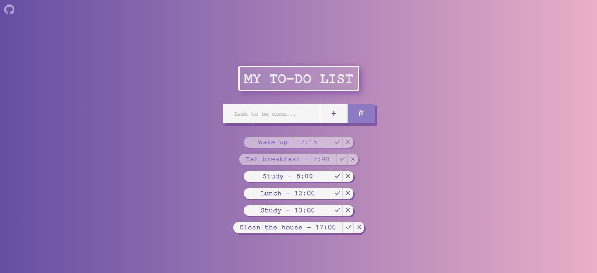

# To-do list page

## [SITE HERE](https://isabdch.github.io/to-do-list/)

## Table of Contents

- [Project Description](#project-description)
- [Status](#status)

## Project Description

This is a to-do list page where you can add tasks, checkmark them and remove them.

- ### HTML

  To create basic HTML content, buttons, forms, etc.

- ### CSS

  To stylize the HTML elements.
  
- ### JavaScript
  
  I learned how to use localStorage and made this project to practice. So I used JSON with localStorage to save the data in the browser storage.

## Status

This project is still in progress. I plan to add some new features and improve some already existing things.
